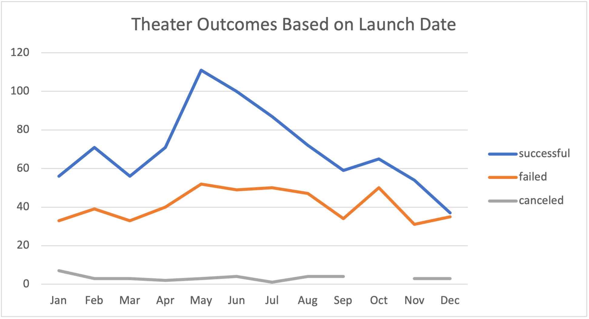
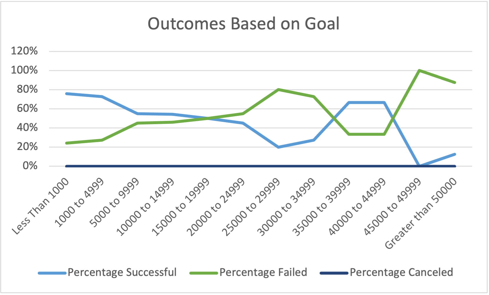

# Kickstarting with Excel

## Overview of Project

This project was for the client Louise, who came close to reaching her Kickstarter fundraising goal for her play *Fever*. In an attempt to find relationships between certain datapoints for other Kickstarters and their outcomes, we can draw conclusions on how Louise can conduct future Kickstarters to the greatest success.

### Purpose

The purpose of this project was to analyze a series of Kickstarter campaigns for Louise. We first found the releationships between launch date and the outcome of each Kickstarter. Then we found the relationships between the goal amount for the Kickstarter and its outcome.

## Analysis and Challenges

We were given a large dataset of thousands of Kickstarter campaigns. Since Louise was specifically running a Kickstarter for a play, we filtered down the Kickstarter dataset to include only data on theater and plays. We use COUNTIFS formulas, pivot tables, along with pivot charts to help Louise visualize the analysis that we conducted. 

### Analysis of Outcomes Based on Launch Date

[Link to Kickstarter Analysis.](https://github.com/SeanDraper/kickstarter-analysis/blob/main/Kickstarter_Challenge.xlsx) The Theater Outcomes by Launch Date sheet holds relevant data for this section.

The first analysis for Louise was to determine the relationship between launch date and the outcome of each Kickstarter. We created a pivot table of all the Kickstarter data with filters for parent category and years, the month each Kickstarter was created, and then displayed the outcomes successful, failed, or canceled for each month. Using this pivot table, we created a pivot chart and specifically a stacked line chart to help Louise visualize this data. Using this chart, you can easily see how successful campaigns were based on the month they were created.

### Analysis of Outcomes Based on Goals

[Link to Kickstarter Analysis.](https://github.com/SeanDraper/kickstarter-analysis/blob/main/Kickstarter_Challenge.xlsx) The Outcomes Based on Goals sheet holds relevant data for this section.

We then ran analysis looking at how the goal amount for each Kickstarter effected its outcome. We used COUNTIFS formulas to pull specific data from the main Kickstarter dataset to only include data for the specific goal range we were looking for along with filtering for plays. We then displayed how many of those projects succeeded, failed, or were canceled along with percentage breakdowns for each of the results. We then created a line chart to display the percentage of successful, failed, and cancelled Kickstarters based on each goal range.

### Challenges and Difficulties Encountered

- Overall the challenge was clear and straight forward, but there were some issues that could be encountered. 

- In the Theater Outcomes by Launch date section, when the pivot table is first created, the data is displayed based on year. In order to change the pivot table to be viewed based on month, we had to choose "month" from the "grouping" section. 

- In the Outcomes Based on Goals sheet, the COUNTIFS formulas could get fairly complicated. You had to keep track of each additional IF parameter and seperate them by commas alternating between the column reference and parameter. Then in order to not have to write a new formula for each individual cell, you had to use absolute references for the column references. This allowed us to spread the formula to each new cell and keep the column references. Although the column refernces to the Kickstarter dataset were absolute, we still had to change certain permaters based "successful, "failed", or "canceled" once the forumlas were spread to the new cells. It could be difficult to keep track of what portions of the COUNTIFS formulas must be changed.

## Results

- What are two conclusions you can draw about the Outcomes based on Launch Date?

1. The first conclusion that could be drawn from the Outcomes Based on Launch Date chart, is that the highest success rate came during the summer, specifically in the May-June months. The number of successful campaigns was more than double the number of failures for each of those months.

2. Secondly, the months late in the year had the worst rate of success, specifcally October and December. In each of those months, the number of successful campaigns was just slightly higher than the number of failures, a sharp decrease in comparison to the rest of the months of the year.

- What can you conclude about the Outcomes based on Goals?

While analyzing the Outcomes based on Goals data there are some clear indicators of success. Kickstarter campaigns that set a lower goal ranging from less than $1000 to $15,000 had a higher success rate than failure. The goal amounts that would be considered "medium" had a much higher failure rate than success. These ranged from $20,000 to $35,000. There seemed to be a "sweet spot" of success at the mid to higher end of goal amount ranging from $35,000 to $45,000. But any goal amount higher than this had a drastic failure rate in comparison to success.

- What are some limitations of this dataset?

Although there were thousands of Kickstarters in the initial dataset, when you filtered down the data to include just plays, the sample size was much less. We encountered an issue with this when analyzing the Outcomes Based on Goals. Although there were hundreds of Kickstarters for plays on the low end of goal amount (less than $1000 to $10,000), there were much fewer in the mid to high range. Because of this, it is difficult to draw accurate conclusions for Kickstarters with higher goal amounts because the sample size is so low.

- What are some other possible tables and/or graphs that we could create?

1. One possible datapoint that we could analyze to determine if there was a correlation with success is the number of backers for each Kickstarter. Kickstarters with a large number of backers with lots of interest could have a higher success rate. We would create this chart silimilarly to the Outcomes Based on Goals chart. We would segment the number of backers into pockets of ranges then use COUNTIFS formulas to determine the number of successful, failed, and cancelled campaigns. We then would use a line graph to display our results.

2. Although Louise wanted data specifcally on plays for her analysis, other parent and sub categories' trends could help her make decisions about her plays. We could make the same Outcomes Based on Goals and Outcomes Based on Launch Date charts for each of the parent categories with larger data sets. We then could compare the results for each category and identify trends.
